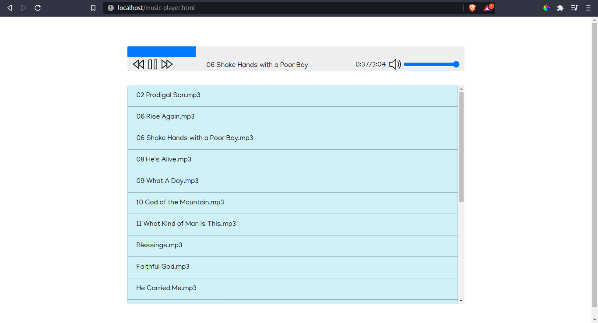

# JavaScript_Music_Player

A music player written in HTML, CSS, and JavaScript. Fetches all files in `music/`. Code is kinda messy :|

#### NOTE:
This will only work running on a server even though it's just JavaScript because I used a get request to fetch the files from the music directory. It's probably not the most effective thing to do, but I couldn't figure out how else to list directory contents without going with a server side language.

### Screenshots

